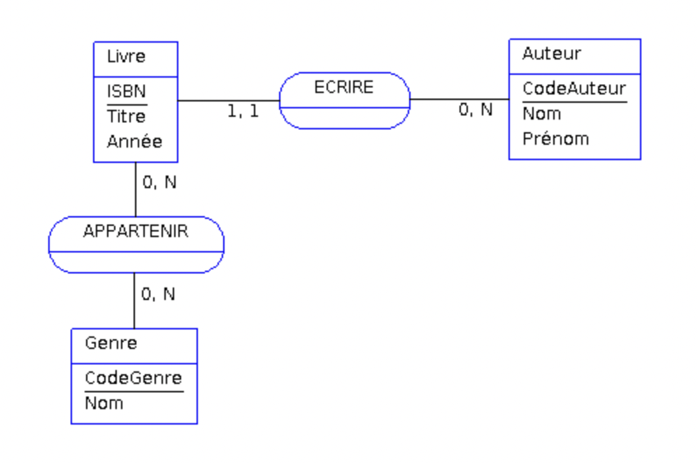

# MLD

Exemple MCD :

**Le modèle logique devient plus concret et est une étape vers le modèle physique final. Le MLD découle directement du MCD**, en appliquant quelques règles - toute la réflexion a été faite au niveau du MCD.

En pratique vous pouvez passez directement au MPD mais vous ne vous éviterez pas de *convertir votre MCD en un modèle physique*. **Voici les 3 règles principales permettant d'effectuer cette conversion** :

## Règle n°1

**Toute entité du MCD devient une table du MLD**. Les propriétés de ces entités deviennent les colonnes des tables. L'identifiant de l'entité devient la clé primaire de la table.

## Règle n°2

Si l'une des cardinalités max. vaut _1_, **une clé étrangère** est créée du côté de l'entité où se trouve le 1. Cette clé étrangère fera référence à l'identifiant dans la table associée.

Dans notre exemple (Livre est écrit par 1 Auteur), c'est donc le Livre qui aura une clé étrangère vers l'Auteur.

## Règle n°3

Si les deux cardinalités max. sont _n_, donc une relation _"plusieurs à plusieurs"_ **la relation devient une table à part entière** en relation avec les deux entités. On parle de *table de liaison, d'association, de jonction ou de correspondance*. Cette table de liaison contient 2 clefs étrangères vers les 2 tables à _lier_.

## Ecriture

Le modèle Entité-Association nous propose d'écrire le MLD sous cette forme _académique_ :

- Personne (<u>CodePersonne</u>, Nom, Prénom)
- Livre (<u>ISBN</u>, Titre, Année, #CodePersonne)
- Genre (<u>CodeGenre</u>, Nom)
- LieuEmprunt (<u>CodeLieu</u>, Nom, Commune, Contact)
- APPARTENIR (<u>ISBN</u>, <u>CodeGenre</u>)
- EMPRUNTER (<u>CodePersonne</u>, <u>ISBN</u>, <u>CodeLieu</u>, dateEmprunt)

=> Nous avons nos **4 tables principales**, dont la table _Livre_ contient une clé étrangère vers _Personne_.  
=> Puis **2 nouvelles tables** _APPARTENIR_ et _EMPRUNTER_ qui contiennent les références aux tables en relation, ainsi que l'attribut supplémentaire _dateEmprunt_.

Bien sûr **nous pouvons faire appel à un logiciel tel que [MySQL Workbench (MSB)](https://www.mysql.com/fr/products/workbench/)** pour créer ce modèle logique. A noter toutefois que la conception sous MSB est en **UML** et non en Merise.

---